# Lab11Web

**Nama : Fery affandi** <br>
**NIM : 312010018** <br>

## Langkah-langkah Praktikum
Sebelum memulai menggunakan Framework Codeigniter, perlu dilakukan konfigurasi
pada webserver.
Beberapa ekstensi PHP perlu diaktifkan untuk kebutuhanpengembangan Codeigniter 4.
Berikut beberapa ekstensi yang perlu diaktifkan:
<br>• php-json ekstension untuk bekerja dengan JSON; <br>
• php-mysqlnd native driver untuk MySQL;<br>
• php-xml ekstension untuk bekerja dengan XML;<br>
• php-intl ekstensi untuk membuat aplikasi multibahasa;<br>
• libcurl (opsional), jika ingin pakai Curl.B=</br>

<br>Untuk mengaktifkan ekstentsi tersebut, melalu <b>XAMPP Control Panel</b>, pada bagian
Apache klik <b>Config -> PHP.ini</b>

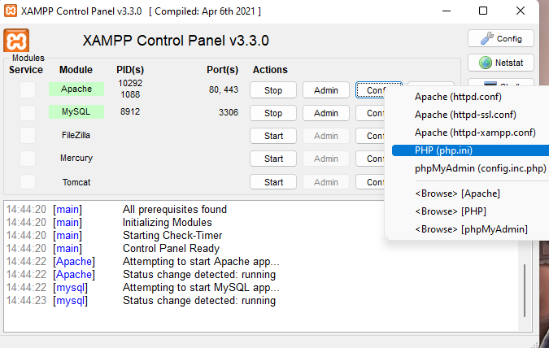
<p align="center">Gambar 11.1 Konfigurasi php

Pada bagian extention, hilangkan tanda ; (titik koma) pada ekstensi yang akan
diaktifkan. Kemudian simpan kembali filenya dan restart Apache web server.

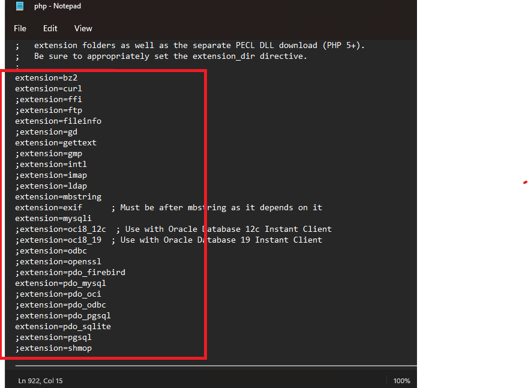
<p align="center">Gambar 11.2 Ekstensi php

### Instalasi Codeigniter 4

Untuk melakukan instalasi Codeigniter 4 dapat dilakukan dengan dua cara, yaitu cara
manual dan menggunakan composer. Pada praktikum ini kita menggunakan cara
manual.

• Unduh Codeigniter dari website https://codeigniter.com/download<br>
• Extrak file zip Codeigniter ke direktori htdocs/lab11_ci.<br>
• Ubah nama direktory framework-4.x.xx menjadi ci4.<br>
• Buka browser dengan alamat http://localhost/lab11_ci/ci4/public/ <br>

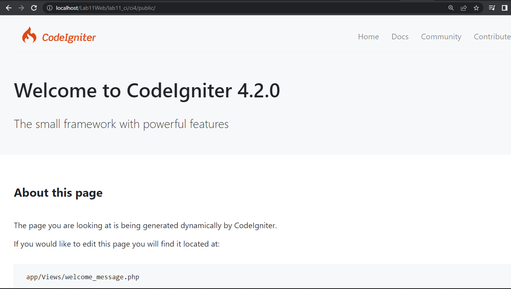

## Menjalankan CLI (Command Line Interface)

Codeigniter 4 menyediakan CLI untuk mempermudah proses development. 
Untuk mengakses CLI buka terminal/command prompt.

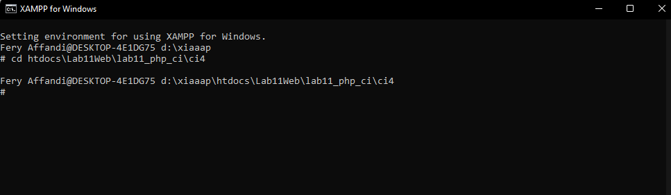

Arahkan lokasi direktori sesuai dengan direktori kerja project dibuat
(xampp/htdocs/lab11_ci/ci4/)

Perintah yang dapat dijalankan untuk memanggil CLI Codeigniter adalah:
``` php
php spark
```

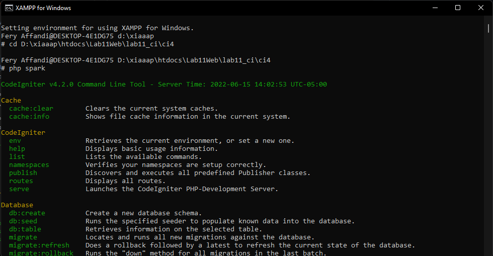

## Mengaktifkan Mode Debugging

Codeigniter 4 menyediakan fitur <b>debugging</b> untuk memudahkan developer untuk
mengetahui pesan error apabila terjadi kesalahan dalam membuat kode program.

Secara default fitur ini belum aktif. Ketika terjadi error pada aplikasi akan ditampilkan
pesan kesalahan seperti berikut.

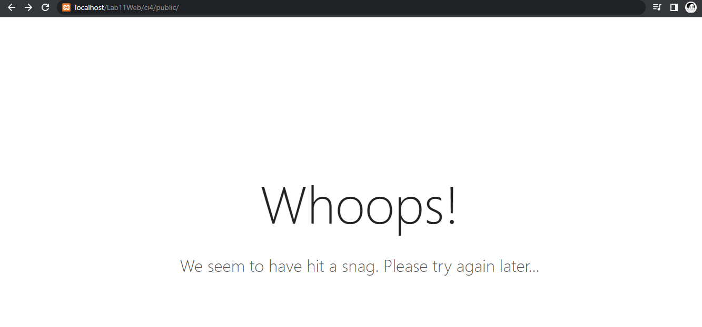

Semua jenis error akan ditampilkan sama. Untuk memudahkan mengetahui jenis
errornya, maka perlu diaktifkan mode debugging dengan mengubah nilai konfigurasi
pada environment variable <B>CI_ENVIRINMENT</b> menjadi <b>development</b>.

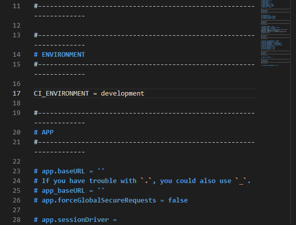

Ubah nama file <b>env</b> menjadi <b>.env</b> kemudian buka file tersebut dan ubah nilai variable
<b>CI_ENVIRINMENT</b> menjadi <b>development</b>. lalu hapus tanda <b>#</b> sebelum CI_ENVIRINMENT.

Contoh error yang terjadi untuk mencoba error tersebut ubah kode pada file <B>app/Controller/Home.php</b> hilangkan (;) pada akhir kode.

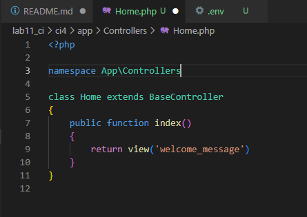
hasilnya 
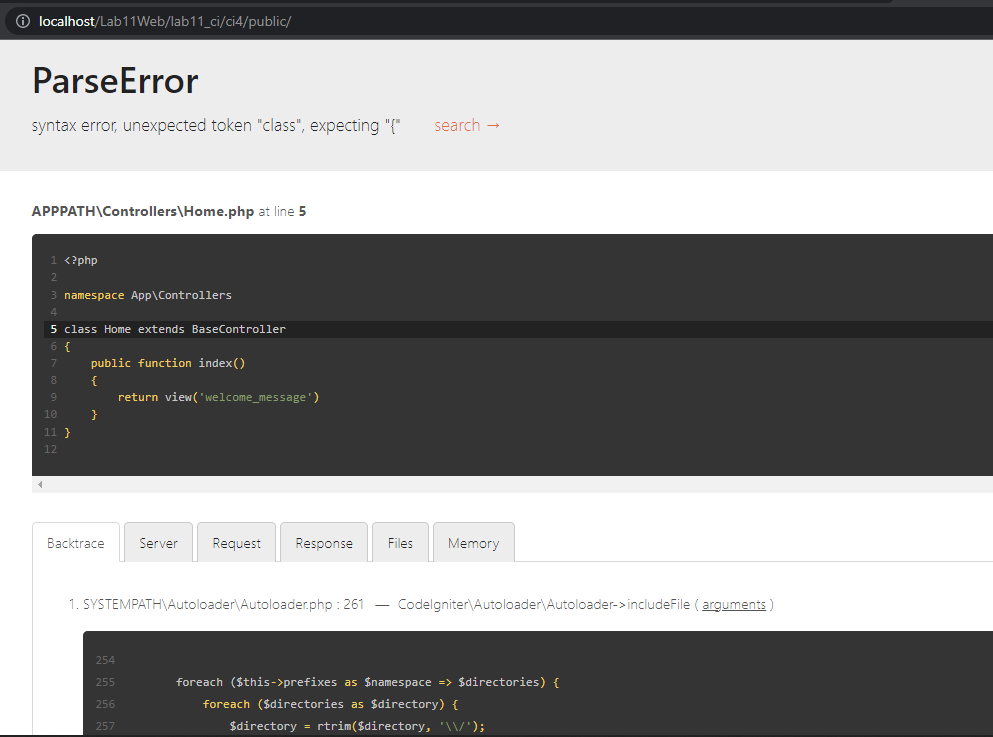

## Membuat Route Baru.

Tambahkan kode berikut di dalam <b>app/Config/Routes.php</b>

```php
$routes->get('/about', 'Page::about');
$routes->get('/contact', 'Page::contact');
$routes->get('/faqs', 'Page::faqs');
```

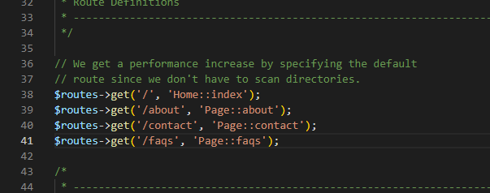

Untuk mengetahui route yang ditambahkan sudah benar, buka CLI dan jalankanperintah berikut.

```php
php spark routes
```

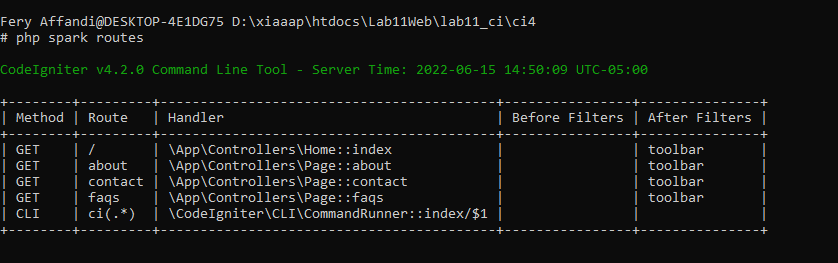

Selanjutnya coba akses route yang telah dibuat dengan mengakses alamat url http://localhost/lab11_php_ci/ci4/public/about

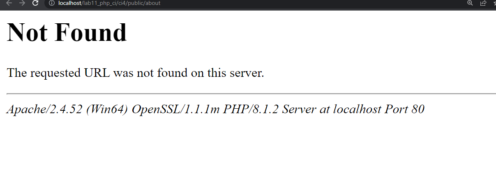

Ketika diakses akan mucul tampilan error 404 file not found, itu artinya file/page tersebut tidak ada. 
Untuk dapat mengakses halaman tersebut, harus dibuat terlebih dahulu Contoller yang sesuai dengan routing yang dibuat yaitu Contoller Page.

## Membuat Controller
Selanjutnya adalah membuat Controller Page. Buat file baru dengan nama <b>page.php</b> pada folder 
pada direktori Controller kemudian isi kodenya seperti berikut.

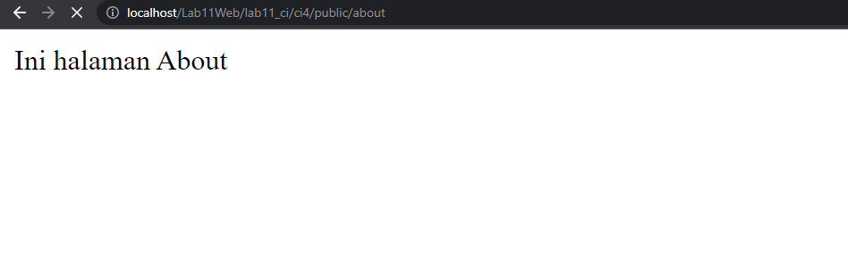

## Auto Routing

Secara default fitur autoroute pada Codeiginiter sudah aktif.
Untuk mengubah status autoroute dapat mengubah nilai variabelnya. 
Untuk menonaktifkan ubah nilai <b>true</b> menjadi <b>false</b>.

Untuk mengubahnya ada di <b>app/Config/Routes.php</b>

```php
$routes->setAutoRoute(true);
```
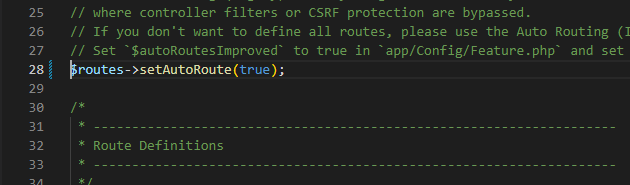

Tambahkan method baru pada Controller Page seperti berikut.
```php
public function tos()
{
echo "ini halaman Term of Services";
}
```

Method ini belum ada pada routing, sehingga cara mengaksesnya dengan menggunakan alamat: http://localhost:8080/page/tos

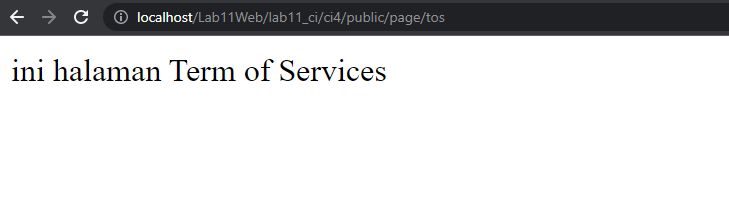

## Membuat View

Selanjutnya adalah membuat view untuk tampilan web agar lebih menarik. Buat file baru dengan nama <b>about.php</b> pada direktori view (app/view/about.php) kemudian isi kodenya seperti berikut.

```php
<!DOCTYPE html>
<html lang="en">
<head>
 <meta charset="UTF-8">
 <title><?= $title; ?></title>
</head>
<body>
 <h1><?= $title; ?></h1>
 <hr>
 <p><?= $content; ?></p>
</body>
</html>
```
Ubah Method about pada class controler page menjadi seperti ini pada <b>app/Controllers/page.php</b>

```php
public function about()
{
 return view('about', [
 'title' => 'Halaman Abot',
 'content' => 'Ini adalah halaman abaut yang menjelaskan tentang isi
halaman ini.'
 ]);
}
```
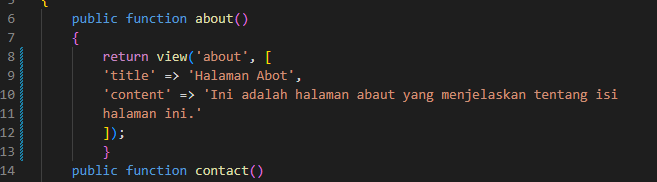

lalu refesh browser dan tampilan pada browsernya akan seperti ini

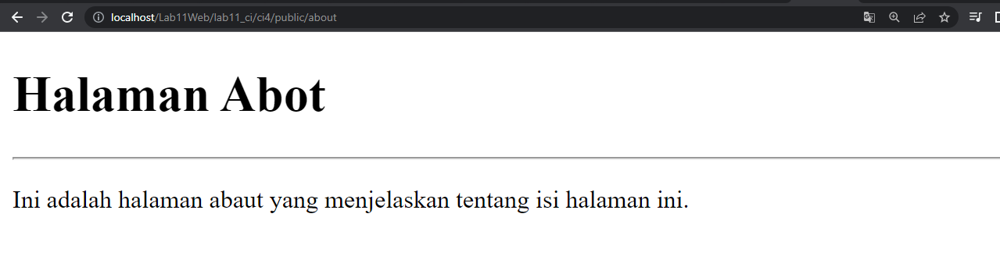

## Membuat Layout Web dengan CSS
Pada dasarnya layout web dengan css dapat diimplementasikan dengan mudah pada codeigniter. 
yang perlu diketahui adalah, pada codeigniter 4 file yang menyimpan asset css dan javascript terletak pada direktori public.

Buat file css pada direktori public dengan nama style.css (copy file dari praktikum lab4_layout kita akan gunakan layout yang pernah dibuat pada praktikum 4.

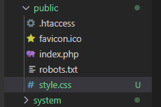

Kemudaian buat folder template pada direktori view kemudian buat file <b>header.php</b> dan <b>footer.php</b>

File <b>(app/view/template/header.php)</b>

```html
<!DOCTYPE html>
<html lang="en">
  <link
    rel="stylesheet"
    href="https://cdn.jsdelivr.net/npm/bootstrap@4.0.0/dist/css/bootstrap.min.css"
    integrity="sha384-Gn5384xqQ1aoWXA+058RXPxPg6fy4IWvTNh0E263XmFcJlSAwiGgFAW/dAiS6JXm"
    crossorigin="anonymous"
  />
  <head>
    <meta charset="UTF-8" />
    <title><?= $title; ?></title>
    <link rel="stylesheet" href="style.css" />
  </head>

  <body>
    <div id="container">
      <header>
        <h1>Layout Sederhana</h1>
      </header>
      <nav>
        <a href="<?= base_url('/'); ?>" class="active">Home</a>
        <a href="<?= base_url('/artikel'); ?>">Artikel</a>
        <a href="<?= base_url('/about'); ?>">About</a>
        <a href="<?= base_url('/contact'); ?>">Kontak</a>
      </nav>
      <section id="wrapper">
        <section id="main"></section>
```

File app/view/template/footer.php
```html
        </section>
        <aside id="sidebar">
            <div class="widget-box">
                <h3 class="title">Widget Header</h3>
                <ul>
                    <li><a href="#">Widget Link</a></li>
                    <li><a href="#">Widget Link</a></li>
                </ul>
            </div>
            <div class="widget-box">
                <h3 class="title">Widget Text</h3>
                <p>Vestibulum lorem elit, iaculis in nisl volutpat, malesuada
                    tincidunt arcu. Proin in leo fringilla, vestibulum mi porta, faucibus felis.
                    Integer pharetra est nunc, nec pretium nunc pretium ac.</p>
            </div>
        </aside>
    </section>
    <footer>
        <p>&copy; 2022 - <i>val_18</i>  </p>
    </footer>
    </div>
</body>
</html>
```

Kemudian ubah file <b>app/view/about.php</b> seperti berikut.
```php
<?= $this->include('template/header'); ?>

<h1><?= $title; ?></h1>
<hr>
<p><?= $content; ?></p>

<?= $this->include('template/footer'); ?>
```

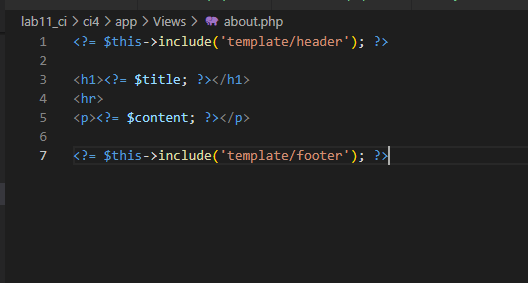

ketika direfresh browsernya maka tampilan webnya akan seperti ini

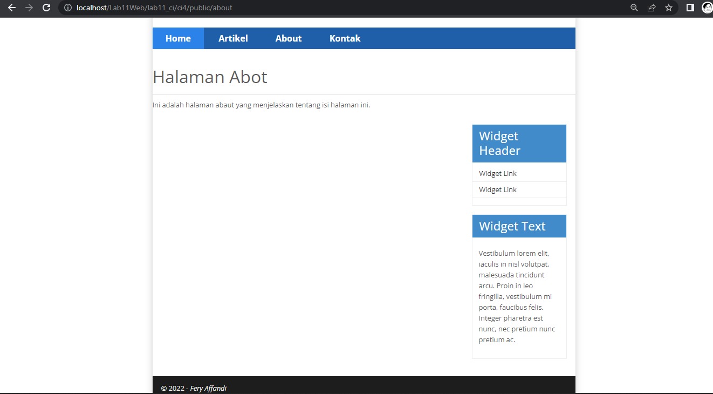

# Prakttikum 12 Framework Lanjutan (CRUD)

**Nama : Fery affandi** <br>
**NIM : 312010018** <br>

## Database 

 1. jalankan `apache dan dan mysql` pada `Xampp` dan membuat database baru dengan nama lab_ci4 di http://localhost/phpmyadmin

2. buat tabel  dengan format
```php
CREATE TABLE artikel (
    id INT(11) auto_increment,
    judul VARCHAR(200) NOT NULL,
    isi TEXT,
    gambar VARCHAR(200),
    status TINYINT(1) DEFAULT 0,
    slug VARCHAR(200),
    PRIMARY KEY(id)
);
```
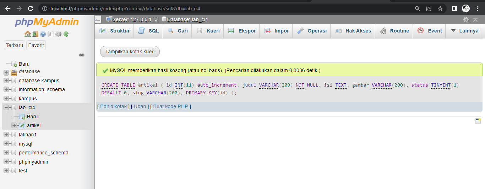

## Konfigurasi koneksi database

Selanjutnya membuat konfigurasi untuk menghubungkan dengan database server. 
Konfigurasi dapat dilakukan dengan du acara, yaitu pada file <b>app/config/database.php</b> 
atau menggunakan file <b>.env</b>. Pada praktikum ini kita gunakan konfigurasi pada file <b>.env</b>. Hapus tanda <b>#</b>.

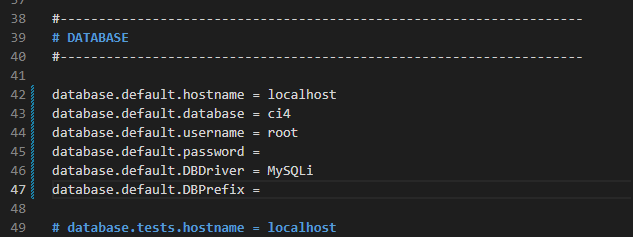

## Membuat Model

Selanjutnya adalah membuat Model untuk memproses data Artikel. Buat file baru pada direktori <b>app/Models</b> dengan nama <b>ArtikelModel.php</b>

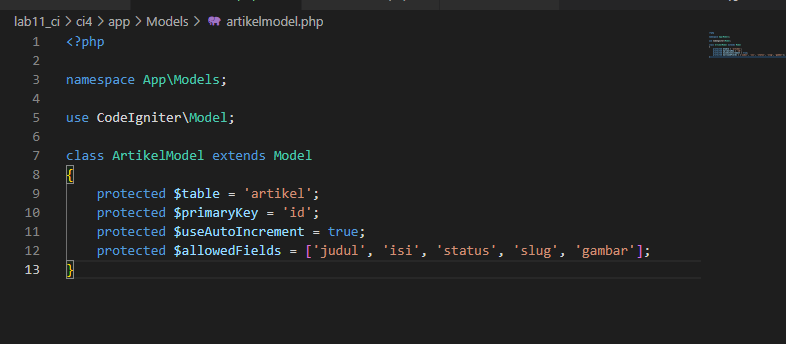

## Membuat Controller

Buat Controller baru dengan nama <b>Artikel.php</b> pada direktori <b>app/Controllers</b>.

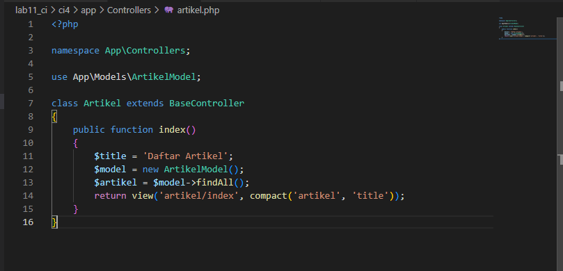

## Membuat View

Buat direktori baru dengan nama artikel pada direktori <b>app/views</b>, kemudian buat file baru dengan nama <b>index.php</b>.

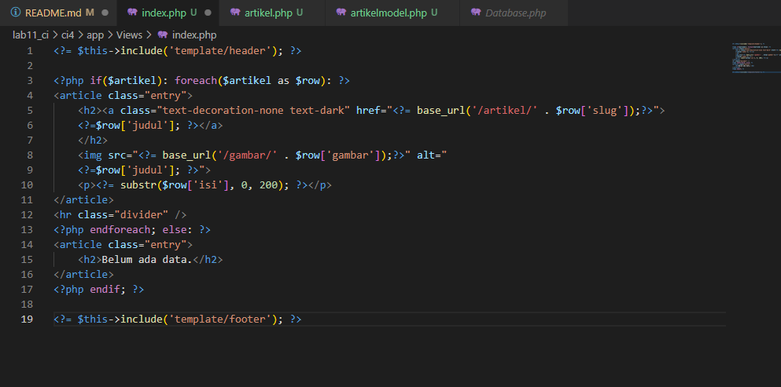

Selanjutnya buka browser kembali, dengan mengakses url http://localhost:8080/artikel